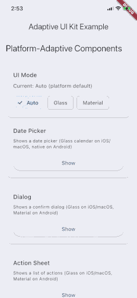
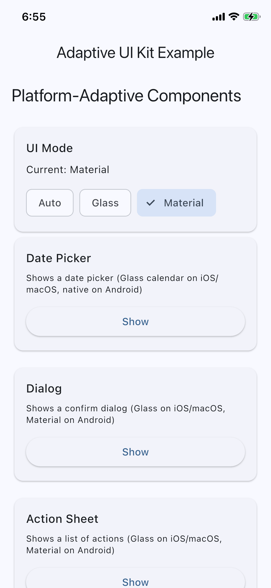
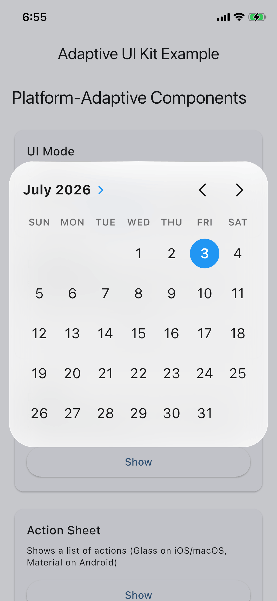
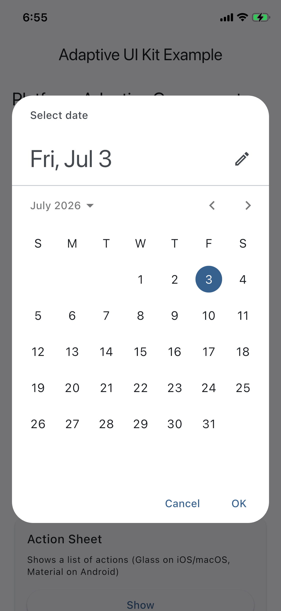
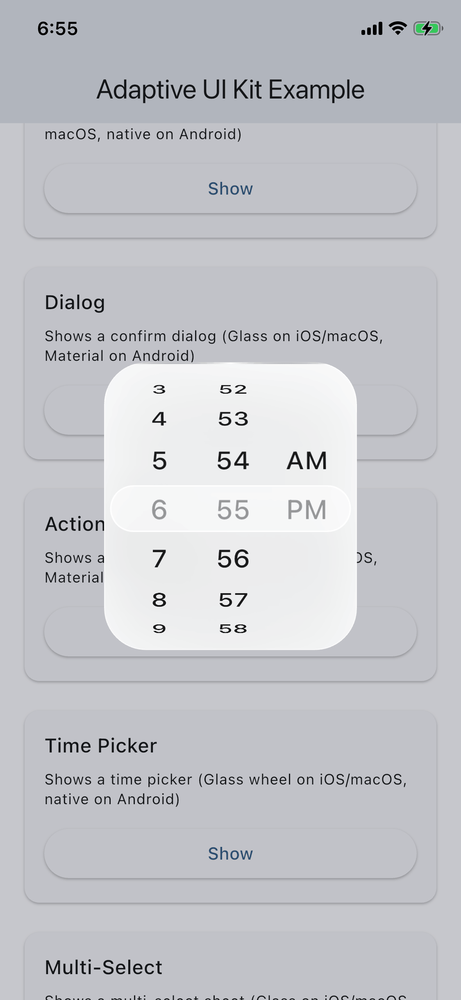
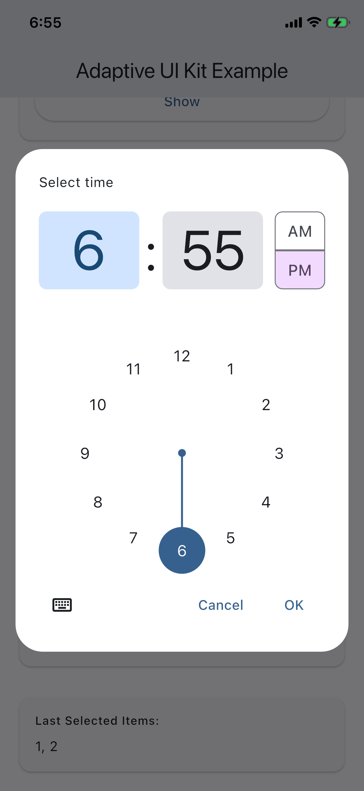

# Adaptive UI Kit

[](https://pub.dev/packages/adaptive_ui_kit)


<p align="center">
A powerful Flutter package for building beautiful **platform-adaptive user interfaces** with a single API.
</p>

---

## ✨ Overview

Adaptive UI Kit automatically renders the correct UI for each platform.

| Platform | Design |
|----------|--------|
| iOS | Apple-inspired Glass UI |
| macOS | Apple-inspired Glass UI |
| Android | Material 3 |
| Web | Material |
| Windows | Material |
| Linux | Material |

No platform checks. No duplicate widgets.

---

## 🎬 Demo



---

# Features

- Automatic platform adaptation
- Adaptive Dialog
- Adaptive Action Sheet
- Adaptive Date Picker
- Adaptive Time Picker
- Adaptive Multi Select
- Global theme configuration
- Force UI Kit support
- Custom resolver support
- Pure Flutter (no GetX required)

---

# Installation

```yaml
dependencies:
  adaptive_ui_kit: ^0.0.1
```

```bash
flutter pub get
```

---

# Quick Start

```dart
import 'package:adaptive_ui_kit/adaptive_ui_kit.dart';

await AdaptiveDialog.showConfirm(
  context: context,
  title: 'Delete Item',
  message: 'Are you sure?',
);

await AdaptiveActionSheet.show(
  context: context,
  title: 'Actions',
  items: [
    ActionSheetItem(
      label: 'Edit',
      icon: Icons.edit,
      onTap: () {},
    ),
  ],
);
```

---

# Components

| Component | Description |
|------------|-------------|
| AdaptiveDialog | Platform adaptive dialog |
| AdaptiveActionSheet | Adaptive action sheet |
| AdaptiveDateTimePicker | Adaptive date picker |
| AdaptiveTimePicker | Adaptive time picker |
| AdaptiveMultiSelect | Adaptive multi select |

---

# Global Configuration

```dart
AdaptiveUiKitConfig.glass =
    AdaptiveUiKitConfig.glass.copyWith(
      tintColor: Colors.indigo,
      blurSigma: 12,
);

AdaptiveUiKitConfig.forceUiKit = AdaptiveUiKit.glass;
```

---

# Architecture

```text
Adaptive Widgets
        │
        ▼
 Platform Resolver
        │
 ┌───────────────┐
 │               │
 ▼               ▼
Glass UI   Material UI
        │
        ▼
 Shared Themes
```

---

## 📸 Screenshots

### Overview



### Adaptive Dialog

| iOS (Glass) | Android (Material) |
|-------------|--------------------| 

### Date Picker

|  |  |

### Time Picker

|  |  |

---

# Example

```bash
cd example
flutter run
```

---

# Roadmap

- Adaptive Snackbar
- Adaptive Toast
- Adaptive Dropdown
- Adaptive Navigation Components
- Adaptive Form Controls
- Adaptive Search Bar
- Adaptive Bottom Navigation

---

# Why Adaptive UI Kit?

Instead of maintaining separate widgets for every platform, write your UI once and let Adaptive UI Kit deliver the native experience automatically.

---

# Contributing

Contributions, bug reports and feature requests are always welcome.

---

# License

MIT License

---

Made with ❤️ using Flutter.
